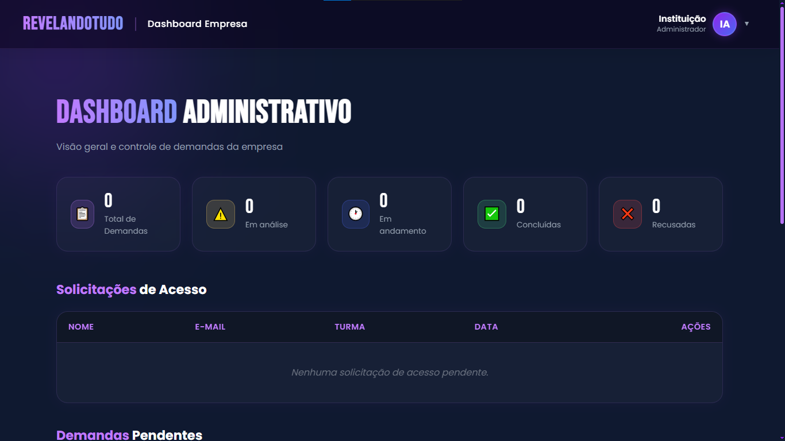
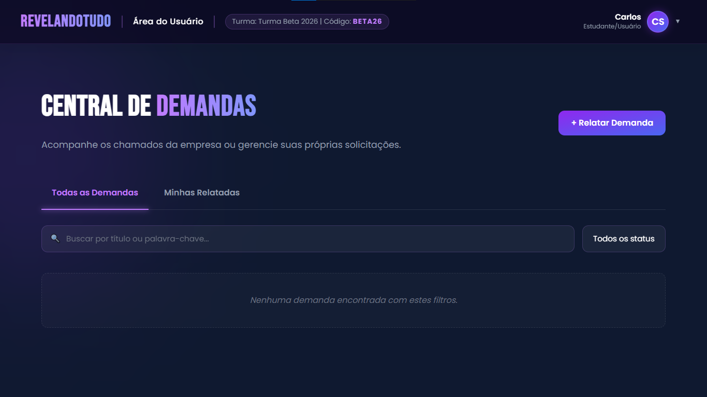

<div align="center">
  
  
  
  
  
  
</div>

<br>

<div align="center">
  <h1>🚀 RevelandoTudo</h1>
  <p><b>"Relatei, e aí?" - O Sistema Inteligente de Gestão de Demandas e Chamados.</b></p>
</div>

---

## 📖 O que é o RevelandoTudo?
O **RevelandoTudo** é uma plataforma moderna projetada para **centralizar, organizar e gerenciar solicitações, melhorias e chamados (demandas)** dentro de instituições acadêmicas e corporativas. 

Muitas vezes, alunos, funcionários ou colaboradores relatam um problema, mas perdem a visibilidade sobre o andamento daquela solicitação. O **RevelandoTudo** resolve essa dor promovendo **transparência e velocidade**! Ele conecta **Instituições (Admins)** e **Estudantes/Colaboradores (Usuários)** em um fluxo onde cada atualização é informada em tempo real e de forma visual.

A plataforma permite que uma instituição cadastre turmas (ou departamentos) e gere **códigos institucionais únicos**. Com esses códigos, os usuários se cadastram no sistema, ficam atrelados às suas respectivas turmas e começam a abrir chamados diretamente para os gestores.

<div align="center">
  
</div>

---

## ✨ Principais Funcionalidades

### 👑 Para Instituições (Administradores)
<div align="center">
  
</div>

*   **Gestão de Acessos:** Administradores possuem um painel para **Aprovar ou Recusar** as contas recém-criadas pelos alunos, mantendo controle rígido sobre quem entra na plataforma.
*   **Gestão de Turmas/Departamentos:** Criação de agrupamentos internos que geram "Códigos Institucionais" para convites.
*   **Painel Gerencial (Dashboard):** Visão panorâmica contendo o número de usuários ativos, total de turmas, quantidade de demandas (abertas, em andamento, resolvidas).
*   **Gestão de Demandas:** O admin pode avançar os status das solicitações (Ex: *Em análise* ➔ *Em andamento* ➔ *Resolvido*), adicionando mensagens públicas que compõem o histórico da demanda.
*   **Comentários Privados:** O admin pode adicionar anotações internas (comentários privados) em um chamado que **apenas outros admins** podem ler, ideal para discussões internas sensíveis.

### 👤 Para Usuários (Estudantes/Colaboradores)
<div align="center">
  
</div>

*   **Autocadastro Seguro:** Usuários se cadastram usando o código fornecido pela instituição. Sua conta fica com status *Pendente* até que um admin o aprove.
*   **Abertura e Acompanhamento de Demandas:** Os usuários podem criar chamados, detalhar o que necessitam e acompanhar de forma interativa a barra de progresso da solução.
*   **Transparência Total:** Uma linha do tempo (timeline) detalha tudo o que a equipe técnica ou administrativa respondeu, garantindo que o usuário nunca fique no escuro.
*   **Visão de Turma:** Os alunos podem visualizar não só as demandas deles mesmos, mas também as demandas de toda a sua turma para evitar relatórios duplicados.

---

## 🛠️ Tecnologias e Dependências

A aplicação foi construída visando performance, escalabilidade e manutenibilidade, separada em arquitetura de **Micro-serviços (Frontend e Backend independentes)**.

### Backend (API Restful)
*   **Node.js & Express.js:** Motor de execução e framework minimalista para construção de rotas HTTP rápidas e eficientes.
*   **Sequelize (ORM):** Mapeamento Objeto-Relacional que abstrai as consultas ao banco de dados e gerencia modelos relacionais.
*   **SQLite:** Banco de dados relacional leve e embutido, perfeito para a facilidade de distribuição.
*   **Bcrypt.js:** Algoritmo robusto para *hashing* seguro de senhas.
*   **JsonWebToken (JWT):** Geração de tokens de autenticação seguros e assinados digitalmente.
*   **Swagger (swagger-ui-express):** Documentação automática da API embutida e interativa.
*   **Jest & Supertest:** Frameworks de testes unitários e de integração de ponta a ponta.

### Frontend (Single Page Application)
*   **Vue.js 3:** Framework reativo e progressivo para interfaces dinâmicas, operando com a Option/Composition API.
*   **Vite:** Build tool extremamente rápido para empacotamento do projeto.
*   **Axios:** Cliente HTTP para comunicação integrada com o Backend.
*   **Vue Router:** Gerenciador de rotas para garantir a experiência fluida sem recarregamento da página (SPA).
*   **Vanilla CSS:** Estilização desenvolvida com responsividade (Glassmorphism, Micro-interações, Design System customizado).
*   **Vitest & Vue Test Utils:** Framework de testes ultramoderno e veloz adaptado para o ecossistema Vue.

---

## 🛡️ Segurança, Robusteza e Qualidade de Código

O **RevelandoTudo** foi arquitetado sob rigorosos padrões da indústria para garantir estabilidade:

1. **Testes Unitários, Integração e E2E Amplos:** 
   O sistema foi construído acompanhado por baterias rígidas de testes.
   *   **Backend (~95% de Cobertura):** Rotas, middlewares, models e controllers são bombardeados por requisições simuladas do Jest com banco de dados isolado/mockado, garantindo proteção contra regressões sistêmicas.
   *   **Frontend (~81% de Cobertura):** Todos os componentes, views, formulários e lógicas de estado foram testados no `Vitest` manipulando a Virtual DOM (`jsdom`), comprovando que o cliente consome a API corretamente sem quebras de interface.

2. **Autenticação Inquebrável:** 
   As senhas nunca são salvas em texto limpo; o `bcrypt` gera hashes de alto custo computacional, evitando ataques de dicionário ou *rainbow tables*. A autorização (RBAC - Role Based Access Control) utiliza validações explícitas de **Role**, impedindo via *middleware* (no backend) e via redirecionamento de rotas (no frontend) que um aluno explore *endpoints* administrativos.

3. **Injeção de Banco de Dados Prevenida:** 
   O uso do ORM `Sequelize` sanitiza (limpa) internamente todas as instruções enviadas para o banco de dados. Nunca concatenamos variáveis brutas nas Queries, erradicando a principal falha da web: a Injeção de SQL.

4. **Escalabilidade & Tratamento de Erros:**
   Todas as rotas da API encontram-se abraçadas por escopos `try/catch`. O sistema nunca desliga perante falhas; ao invés disso, respostas HTTP padronizadas com os devidos _Status Codes_ (`401 Unauthorized`, `404 Not Found`, `500 Server Error`) são devolvidas ao Frontend que amigavelmente informa o usuário sem estourar o layout.

---

## ⚙️ Como executar o projeto passo a passo

Basta seguir os passos abaixo para rodar o projeto do absoluto zero na sua máquina local.

### 1. Pré-requisitos
* Ter o **Node.js** (versão 18 ou superior) instalado em sua máquina.
* Terminal de comando (Prompt de Comando, PowerShell, Git Bash ou Terminal do Mac/Linux).

### 2. Instalando as Dependências
Abra um terminal e acesse a pasta raiz do projeto (onde está o arquivo `package.json`).
```bash
npm install
```

### 3. Configurando as Variáveis de Ambiente
O projeto exige algumas chaves de segurança e caminhos para funcionar (como a chave JWT e o banco de dados).
Na pasta raiz do projeto, renomeie o arquivo `.env.example` para `.env` (ou crie um novo arquivo `.env` e cole o conteúdo do `.env.example`).
O arquivo deve conter as seguintes linhas:
```env
PORT=3000
DB_PATH=./backend/database.sqlite
JWT_SECRET=super_secret_key_revelando_tudo
```

### 4. Inicializando o Backend
Ainda no terminal, na pasta raiz:
```bash
# (Opcional) Crie e popule o banco de dados com contas de demonstração:
npm run seed

# Inicie o servidor em modo de desenvolvimento
npm run dev:backend
```
> O backend rodará na porta `3000`. Você pode acessar a documentação da API em `http://localhost:3000/docs`.

### 5. Executando o Frontend
Abra **um novo terminal** na pasta raiz do projeto (mantendo o terminal do backend rodando).
```bash
# Inicie o servidor frontend
npm run dev:frontend
```
> O sistema fornecerá uma URL (geralmente `http://localhost:5173/`).

### 6. Entrando no Sistema (Caso tenha rodado o seed)
Ao rodar `npm run seed`, as seguintes contas de acesso são geradas com a senha padrão: **`senha123`**

* **Administrador Exemplo:** `admin@alpha.edu`
* **Estudante Exemplo:** `lucas@estudante.com`

---

## 🧪 Rodando a Bateria de Testes

O projeto conta com scripts prontos para atestar a funcionalidade imediata do código.

**Para o Backend:**
```bash
npm run test:backend          # Roda os testes com Jest (pode adicionar -- --coverage para a cobertura)
```

**Para o Frontend:**
```bash
npm run test:frontend         # Roda os testes interativamente no Vitest
npm run coverage:frontend     # Roda os testes calculando a cobertura (modo UI/v8)
```

---

<div align="center">
  <b>Desenvolvido com carinho e foco total na qualidade e resolução de problemas estruturais! ❤️</b>
</div>
